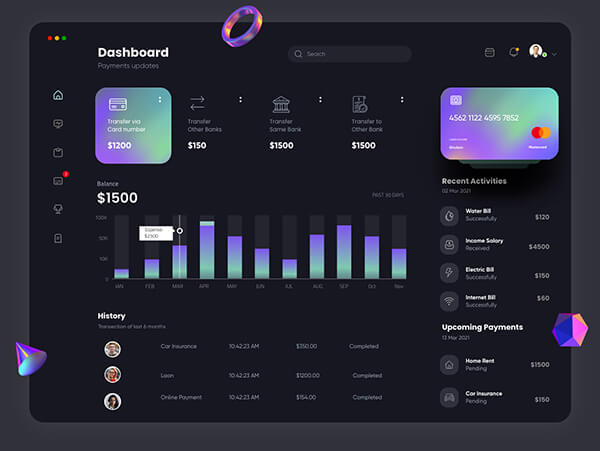

# 个人网站内容填写指南 (vCard)

你的网站已经迁移为 **vCard** 模板（纯 HTML/CSS/JS，炫酷暗色名片风，完全适配 GitHub Pages）。

网站只有一个文件需要编辑内容：**`index.html`**。你的所有个人信息都在这个文件里。

> ⚠️ **重要**：图片请放到 `assets/images/` 目录，然后在 `index.html` 里引用（如 `./assets/images/你的图片.png`）。

---

## 1. 侧边栏（个人信息名片）

文件位置：`index.html` 的 `<aside class="sidebar">`（约第 40–152 行）

| 填写项 | 位置 | 改成你的 |
|--------|------|---------|
| 头像图片 | `` | 换成你自己的照片，放进 `assets/images/`，改 `src` 和 `alt` |
| 姓名 | `<h1 class="name" title="...">Richard hanrick</h1>` | 改成你的名字 |
| 职位/身份 | `<p class="title">Web developer</p>` | 改成你的身份（如 "西工大学生 / AI 开发者"） |
| 邮箱 | `<a href="mailto:richard@example.com">...` | 改成你的邮箱 |
| 电话 | `<a href="tel:+12133522795">...` | 改成你的电话 |
| 生日 | `<time datetime="1982-06-23">June 23, 1982</time>` | 改成你的生日 |
| 所在地 | `<address>Sacramento, California, USA</address>` | 改成你的城市（如 Xi'an, Shaanxi, China） |

### 社交链接（约第 128–148 行）

```html
<li class="social-item">
  <a href="#" class="social-link">
    <ion-icon name="logo-github"></ion-icon>
  </a>
</li>
```
把 `href="#"` 改成你的主页链接，把 `name="logo-xxx"` 改成对应图标名。

**常用社交图标名**（Ionicons）：
| 平台 | name 值 |
|------|---------|
| GitHub | `logo-github` |
| 知乎 | `logo-...`(无内置，可用 `globe-outline`) |
| B站 | 无内置，用 `logo-youtube` 或 `globe-outline` |
| 微信 | 无内置，用 `chatbubble-ellipses-outline` |
| 邮箱 | `mail-outline` |
| X/Twitter | `logo-twitter` |
| 领英 | `logo-linkedin` |
| 个人网站 | `globe-outline` |

> 💡 vCard 用的是 [Ionicons](https://ionic.io/ionicons) 图标库，没有的国内平台图标可用通用图标替代。

---

## 2. About（关于我）

文件位置：`index.html` 的 `<section class="about">`

### 个人简介（约第 175–180 行）
```html
<p class="about-text">
  这里写你的自我介绍...
</p>
```

### 服务/技能卡片 "What i'm doing"（约第 200–280 行）
4 张卡片：Web design / Web development / Mobile apps / Photography
每张卡片结构：
```html
<li class="service-item">
  <div class="service-icon-box">
    
  </div>
  <div class="service-content-box">
    <h4 class="h4 service-item-title">卡片标题</h4>
    <p class="service-item-text">卡片描述</p>
  </div>
</li>
```
把标题和描述改成你的能力（如 AI 开发 / 桌面应用 / 机器学习 / 竞赛项目）。

### 客户/合作方 Logo（约第 300–340 行）
`<li class="clients-item">` 里的 logo 图片可替换或删减。

---

## 3. Resume（简历）

文件位置：`index.html` 的 `<section class="resume">`

### 教育经历（约第 360–440 行，`Education`）
每段结构：
```html
<div class="timeline-item">
  <h4 class="h4 timeline-item-title">西北工业大学</h4>
  <span>2022 — 2026</span>
  <p class="timeline-text">专业、方向描述...</p>
</div>
```
改成你的学校/专业。

### 经历/项目（约第 450–530 行，`Experience`）
改成你的工作/项目经历。

### 技能进度条（约第 550–600 行，`My skills`）
```html
<div class="skill-progress-bg">
  <div class="skill-progress-fill" style="width: 80%;"></div>
</div>
```
`width: 80%` 改成你的技能熟练度百分比，前面的文字改成技能名。

---

## 4. Portfolio（项目展示）

文件位置：`index.html` 的 `<section class="portfolio">`（约第 620–760 行）

**筛选分类**（约第 635–675 行）：`All / Web design / Applications / Web development` 改成你的项目分类。

**每个项目**：
```html
<li class="project-item active" data-filter-item data-category="web development">
  <a href="#">
    <figure class="project-img">
      <div class="project-item-icon-box"><ion-icon name="eye-outline"></ion-icon></div>
      
    </figure>
    <h3 class="project-title">项目名</h3>
    <p class="project-category">项目分类</p>
  </a>
</li>
```
- `data-category="web development"` 对应上方筛选分类（小写，空格隔开）
- `src` 改成项目截图
- 标题和分类改成你的真实项目

---

## 5. Blog（个人文章）

文件位置：`index.html` 的 `<section class="blog">`（约第 780–900 行）

每篇文章卡片：
```html
<li class="blog-post-item">
  <a href="文章链接">
    <figure class="blog-banner-box">
      
    </figure>
    <div class="blog-content">
      <div class="blog-meta">
        <p class="blog-category">分类</p>
        <span class="dot"></span>
        <time datetime="2022-02-23">Feb 23, 2022</time>
      </div>
      <h3 class="h3 blog-item-title">文章标题</h3>
      <p class="blog-text">文章摘要</p>
    </div>
  </a>
</li>
```
- `href="文章链接"` 改成你的文章地址（可以是 GitHub 仓库、博客、外部链接）
- 改成你的真实文章标题、日期、摘要

---

## 6. Contact（联系表单）

文件位置：`index.html` 的 `<section class="contact">`（约第 920–1010 行）

vCard 的默认表单**没有真实发送功能**（纯静态限制）。有 3 种处理方式：
1. **直接删掉表单区**，只保留你的联系方式
2. 接入 [Formspree](https://formspree.io/) 免费服务（改 form 的 action）
3. 接入 [Getform](https://getform.io/)

如果想快速可用，建议**方式 1**：把表单 `action` 改为 `mailto:你的邮箱`，或直接删除表单区域。

---

## 7. 其他小改动

| 项 | 位置 | 说明 |
|----|------|------|
| 网页标题 | `<title>vCard - Personal Portfolio</title>`（第 8 行） | 改成 "你的名字 - Personal Portfolio" |
| 浏览器标签图标 | `<link rel="shortcut icon" href="./assets/images/logo.ico">` | 换成你的图标 |
| 网页语言 | `<html lang="en">`（第 2 行） | 如显示中文可改 `lang="zh-CN"` |

---

## 填完后如何查看

本地预览：
```bash
# 在仓库根目录运行
python -m http.server 8000
# 浏览器打开 http://localhost:8000
```

部署到 GitHub Pages：
1. 修改完提交推送
2. GitHub 仓库 → Settings → Pages → Source 选 `Deploy from a branch` → `main` / `/ (root)`
3. 站点会发布到 `https://qiyuxi24.github.io/`

> 因为已添加 `.nojekyll` 文件，GitHub Pages 会直接发布静态文件，不会被 Jekyll 处理，放心使用。

---

## 备份说明

旧的 Jekyll（Academic Pages）模板内容已备份到 **`_legacy_jekyll/`** 目录，如果你不需要可以删除该目录；需要时也可从中找回旧内容。
