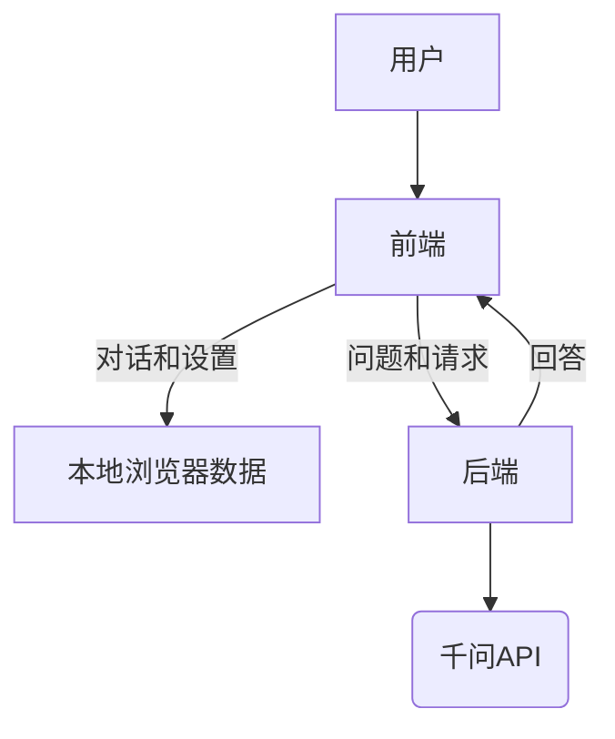

# AI辅助引导式教学网站     

这是一个旨在帮助在使用AI学习遇到困难的人群的网站

---
### 不同模式切换   

1.**引导模式**
  > - 不会在提问是一次就给出答案，而是以逻辑中的关键步骤为节点，逐渐引导用户来进行思考  
  > - 适用于想要按步骤掌握知识点的用户，每次投放的信息量少，更易于学习

2.**直接回答模式**
 > - 类似于常规的AI回答的风格，会直接给出完整的解题步骤
 > - 适用于急于获得答案的用户

3.**检验模式**
> - 该模式下，会由AI来提问，用户来回答，AI可以来检查用户回答的正确性，并给出建议
> - 适用于要找出漏洞或者巩固知识点的用户
---
### 工作流程图

### 要实现的功能列表   
---
- [ ] API接口调试
- [ ] 回答流程固定化（代码层面）
- [ ] 用户数据本地化，存储在浏览器的缓存中
- [ ] 后端代码的支持
- [ ] 对于不同模式设置提示词并且调试（模式切换）
- [ ] 前端的界面优化
- [ ] 附加功能`语音输入输出`和`图片识别`和`朗读`   
- [ ] 一个好看的图片
- [ ] （选做）账户密码
- [ ] （选做）知识图谱

> &#x1f4fb; **推荐阅读**